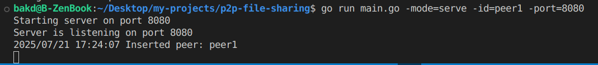

# P2P Concurrent File Transfer Tool in Go

This project is a high-performance TCP-based file transfer system written in Go. It supports **chunked file sending**, **SHA256 validation**, and **concurrent downloads** via multiple TCP connections.

Ideal for learning low-level networking, protocol design, and concurrent programming.

## Features:
-  SHA256 hashing for per-chunk integrity
-  Concurrent chunk downloads
-  Works on local networks or across the internet
-  Written fully in Go — no third-party dependencies

## build Instructions
Clone the repo:

```bash
git clone git@github.com:baqdauletd/p2p-file-sharing.git
cd concurrent-file-transfer

#create an executable file
go build -o p2p-file-sharing
```

## Run the App
### Start the Server
```bash
./p2p-file-sharing -mode=serve -port=8080 -id=peer1
```


### Start the Client
 - ports HAVE TO be the same for the connection to work
```bash
./p2p-file-sharing -mode=connect -port=8080 -id=peer2
```

### Check for Other Available Peers
```bash
./p2p-file-sharing -mode=peers
```


## Author
Bakdaulet Dauletov

## License
MIT License — feel free to use, modify, and distribute


